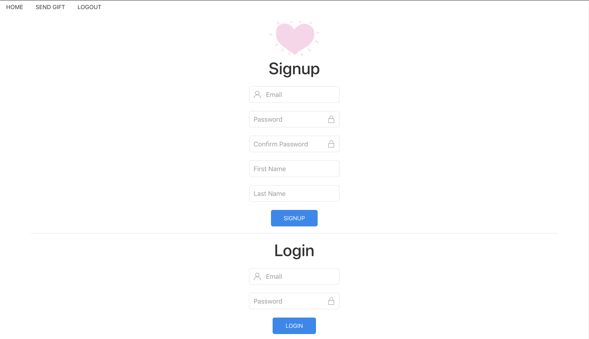
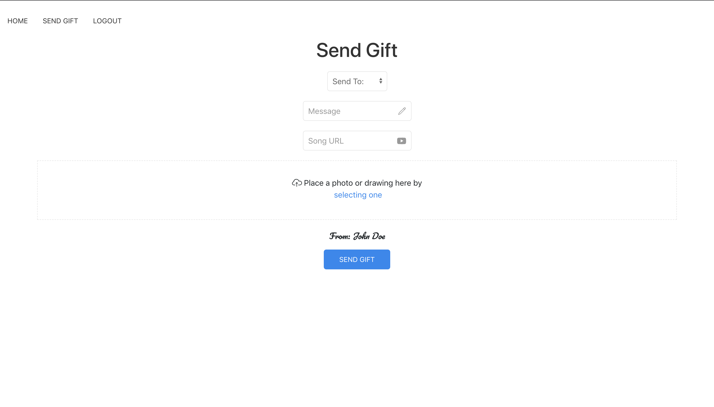
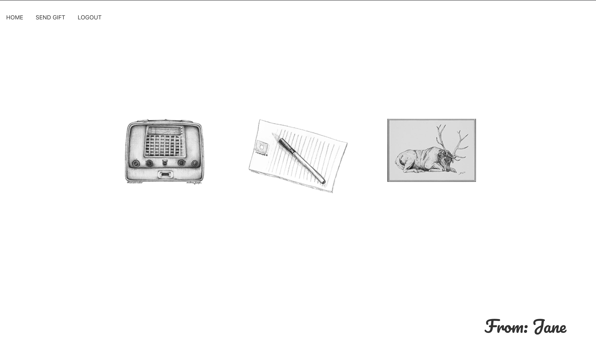
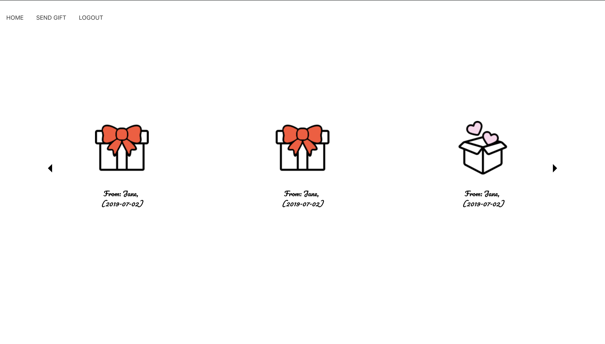

# Gifter

Web app where users can send other users personal electronic card containing a message, a image, and a song. [*Gifter Backend*](https://github.com/kangyongn/gifter_backend)

## Project Aim
1. Create a web app where users can send and receive personalized electronic cards.
2. Permit users to send a image, a song, and a note.
3. Implement Active Storage for image file upload to allow further personalization.
4. Use YouTube URL to output music.
5. Enhance UI by stylizing web app with images, and functions.

## Gifter's Design
1. Any registered user can create a electronic card to send to other registered user.

2. An electronic card needs to be customized by uploading a image file, inserting a YouTube URL, and entering a note for the receiver to listen and view.

3. All electronic cards and it's content persist in the database with the sender's name and the date received, so the recipient can review and enjoy all their previous cards.

## Resources Used
* React
* Active Storage
* UI Kit
* Bootstrap
